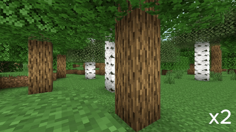
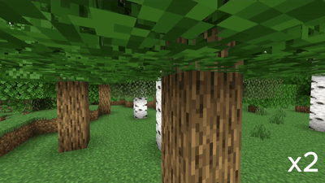
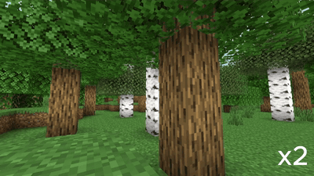
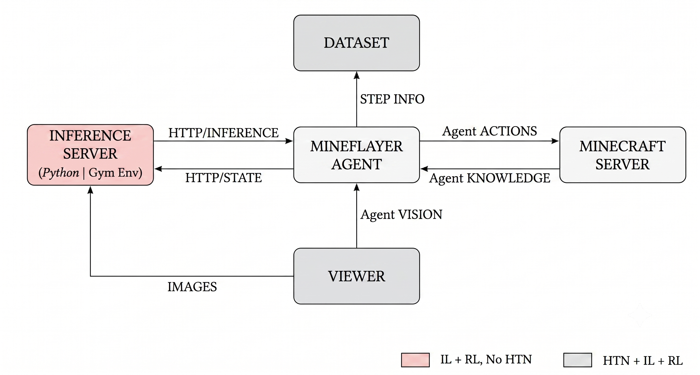

# AI Agents in Minecraft — HTN vs Imitation vs Reinforcement Learning

> Bachelor's thesis comparing a hand-crafted planner against learned agents on autonomous control in a 3D complex world; using **woodcutting** as a benchmark task.


<p align="center">
  
  &nbsp;
  
  <br>
  <em>Left: HTN planner (100% success). Right: imitation-learning agent, GRU backbone (52%).</em>
</p>

## Overview

Three families of agents are compared using a Minecraft bot on the same **woodcutting** task
(chop ≥ 5 logs). The task demands visual perception,
navigation, alignment and a sparse reward.

| Approach | What it is |
|---|---|
| **HTN** | Hierarchical Task Network; a hand-crafted, rule-based planner. |
| **IL**  | Imitation Learning; a visual + recurrent model trained on HTN demonstrations. Dual head: discrete action + continuous camera. |
| **RL**  | Reinforcement Learning; a custom PyTorch DQN, PPO and SAC, plus a SAC + DAgger variant with a symbolic tutor. |

**The question:** *can a learned agent match a hand-crafted planner on this task?*

> **TL;DR** — HTN **100%** ≫ best imitation agent (GRU) **52%** ≫ best RL agent (PPO) **12%**.
> Imitation *quadruples* RL on this task. Details in [Results](#results).

## Results

Protocol: **50 episodes** per technique, same world, max **200 steps**. Success = **≥ 5 logs**.

| Technique | Success (%) | Logs / ep (μ) | Time / ep (s) |
|---|:--:|:--:|:--:|
| **HTN** (planner, upper bound) | **100.0** | 6.00 | 26.7 |
| **IL-GRU** (CNN + GRU + LSTM) | **52.0** | 3.84 | 156.2 |
| IL-ViT (timm ViT + LSTM) | 46.0 | 3.48 | 156.7 |
| RL-PPO | 12.0 | 2.14 | 114.6 |
| RL-RANDOM *(baseline)* | 6.0 | 1.50 | 97.6 |
| RL-SAC | 4.0 | 1.62 | 110.6 |
| IL-STATE (no vision) | 4.0 | 0.54 | 195.8 |
| RL-DQN | 2.0 | 1.10 | 117.6 |
| IL-ConvLSTM | 0.0 | 0.08 | 203.0 |

- The **HTN is the ceiling**: perfect success, ~27 s per episode — but it relies on privileged world knowledge.
- **Imitation beats reinforcement 4×** (52% vs 12%).
- **DQN and SAC don't beat random** at the ≥5-log bar: more time and compute would be needed to
  learn a strong policy. They *do* solve the task at lower thresholds — e.g. PPO scores 78% at
  ≥1 log and 64% at ≥2, but only 12% at ≥5.

<p align="center">
  
  <br>
  <em>Reinforcement-learning agent (PPO) — approaches trees but rarely finishes the ≥5-log target.</em>
</p>

Full analysis (Spanish): [**memoria_tfg.pdf**](memoria/modelo-tfg-fic-v1.6_2223xun/memoria_tfg.pdf).

## How it works

Each agent is a Node.js process driving the bot through [Mineflayer](https://github.com/PrismarineJS/mineflayer);
the learned agents talk to a Python layer over HTTP.

<p align="center">
  
</p>

**Pipeline:** HTN gameplay -> `dataset_recorder.js` (screenshot + state + action + camera)
-> `dataset.py` / `load_dataset.py` (clean + augment) -> `main.py` (train).

**Task & reward (woodcutting):** rewards for hitting/breaking/collecting logs, a small per-step
penalty and a success bonus; episodes end on the log target, a step cap, or a reward floor.
Full action/state/reward specs are in the thesis.

## Quickstart

**Requires:** Minecraft Java server (1.21.x), Node.js 20+, Python 3.11+, and a CUDA GPU for training.

```bash
npm install
pip install -r requirements.txt

# HTN — run the planner (also records the IL dataset)
node scripts/run.js --agents htn --names HTNBot
node scripts/mass_record.js

# IL — train a backbone (rnn | convlstm | vit), then serve + run the agent
python src/il/train/main.py --dataset data/train.jsonl --model vit --epochs 30
python src/il/serve/inference_server.py --model <run>/best_model.pt
node scripts/run.js --agents il --names ILBot

# RL — launch the Node bridge, then train / evaluate
node scripts/run.js --agents rl --names RLBot
python src/rl/state/train.py                    --episodes 200   # state-only DQN
python src/rl/visual/train/train_sac.py         --episodes 600   # or train_ppo / train / train_hybrid_sac / train_sac_dagger / train_random
python src/rl/visual/eval/eval_policy.py --algo sac --checkpoint <run>/sac_final.pth --episodes 15
```

## Project structure

```
src/
├── agents/                # Node.js agent wrappers (HTN, IL, RL) + bot factory
├── htn/                   # HTN planner: primitives / progression / tasks
├── il/                    # Imitation learning
│   ├── models/            #   model (CNN+GRU/ViT) + ConvLSTM variant
│   ├── data/              #   dataset recorder (js) + loading/augmentation
│   ├── train/             #   training (dual head) + plots/GradCAM
│   ├── serve/             #   FastAPI inference server + test client
│   └── analysis/          #   confusion matrices, backbone comparison
├── rl/                    # Reinforcement learning
│   ├── shared/            #   Gymnasium HTTP bridge, constants, metrics
│   ├── state/             #   state-only DQN (no images)
│   ├── visual/            #   visual RL, by role: algorithms / models / train / eval
│   └── minerl/            #   MineRL Treechop utilities (Hybrid SAC warm-start)
└── evaluation/            # comparative harness + plotting + GradCAM icons
scripts/                   # Node launchers: run, mass_record, reset_world, paper_server
docs/figures/              # README figures (demo GIFs + architecture diagram)
memoria/                   # Bachelor's thesis (LaTeX sources + PDF, Spanish)
```

## Tech stack

**Bot:** Mineflayer (+ pathfinder / pvp / collectblock / auto-eat / armor-manager),
Prismarine-viewer, Puppeteer (screenshot capture).
**ML:** PyTorch 2.5 (CUDA 12.1), TorchVision, [timm](https://github.com/huggingface/pytorch-image-models)
(ViT), Gymnasium, FastAPI + Uvicorn (inference server), GradCAM. All models trained from
scratch.

## Context

Bachelor's Thesis (TFG) at UDC. The goal was not just to make the agents work, but to
understand *why* each paradigm succeeds or fails: the HTN solves the full wood progression but needs
world information to work, while the trained agents perform worse but provide more flexibility and a bigger horizon for generalization. 
The task is small on purpose, but  still presents hard challenges in AI training: perception, navigation, alignment, sparse reward.